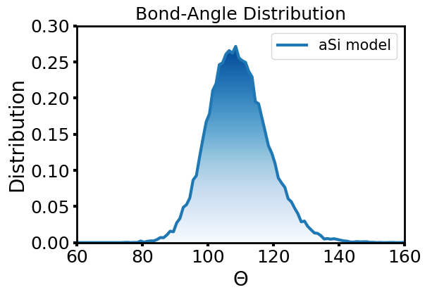

# StructureAnalysis
Program to Calculate Structural Properties of Amorphous Materials
Program to calculate structural properties of amorphous silicon
The program reads a configuration of amorphous silicon model as 
a single XYZ file and calculates Rair-Correlation Function (PCF)
Structure Factor (S(k)), Bond-Angle Distribution (BAD), and   
generate Coordination Number (CN) and Nearest Neighor Map (NMAP)

DIL LIMBU, USM
APRIL 2018

TO COMPILE:: Use Makefile provided

USAGE:: ./structure.x INPUT.XYZ

OUTPUTS:: 
           gr.dat   <- Pair Correlation Function
           Sk.dat   <- Structure Factor
           bad.dat  <- Bond Angle Distribution
           Cn.dat   <- Coordination Number
           nmap.dat <- List of ALL Nearest Neighbors
PLOT::
      RUN Python script to generate plots

  
   
  

